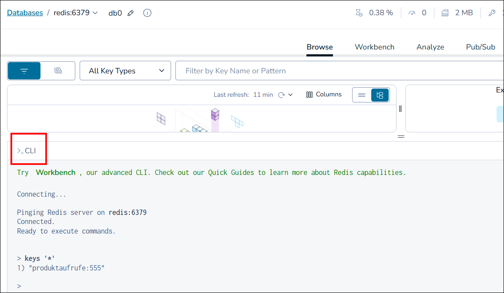
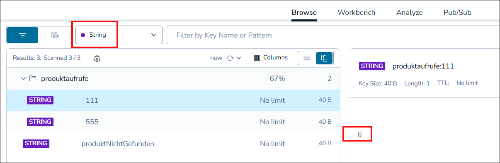

# Docker-Container für Redis #

<br>

Dieser Ordner enthält eine Datei [docker-compose.yml](docker-compose.yml) 
für den Start eines Containers mit der In-Memory-Datenbank [Redis](https://redis.io/de/)
und [Redis Insights](https://redis.io/insight/) als GUI für den direkten Zugriff auf die Redis-Instanz.

<br>

## Konfiguration *Redis Insights* ##

<br>

Verbindungs-URL: 
```
redis://default@redis:6379
```
Hierbei ist das `redis` nach dem `@`-Zeichen der Name des Containers mit dem Redis-Server
und `6379` die Default-Port-Nummer.

<br>


<br>

Nach einer Verbindung kann über "CLI" unten auch ein Kommandozeilenfenster geöffnet werden 
(siehe nächster Abschnitt für CLI-Befehle):



<br>

Die von der Anwendung gespeicherten Zählerwerte sind technisch gesehen Strings (die aber nur Ziffern enthalten dürfen):



Nach Klick auf einen Key in der linken Seite der Oberfläche wird in der rechten Seite der jeweilige Wert angezeigt.
Die Zählerwerte für die erfolgreichen Abrufe von Produktdetails haben alle die Form `produktaufrufe:<produktnr>` 
(z.B. `produktaufrufe:111`), deshalb werden diese in einem Ordner "produktaufrufe" dargestellt, der aufgeklappt 
werden muss. 

<br>

## Befehle für `redis-cli` ##

<br>

Terminal zu Container mit Redis-Instanz öffnen und Redis-CLI mit Befehl `redis-cli` starten.
Im folgenden werden einige Befehle aufgelistet, die dieses CLI versteht.

<br>

Verbindungstest: `ping` (Antwort sollte `PONG` sein)

<br>

Alle Schlüssel ausgeben:
```
keys '*'
```

<br>

Einzelnen Wert ausgeben:
```
get produktNichtGefunden
```

<br>

Wert für bestimmten Schlüssel setzen:
```
set produktNichtGefunden 123
```

<br>

Einzelnes Key-Value-Paar löschen:
```
del produktNichtGefunden
```

<br>

Zähler um +1 bzw. beliebigen Wert erhöhen; es muss der Key einer String-Variable, die
nur Ziffern enthält, referenziert werden:
```
incr   zaehler
incrBy zaehler 3
```
Der neue Zählerwert wird zurückgegeben; die Variable wird bei Bedarf angelegt.


<br>

Konfiguration für Persistenzmechanismen RDB bzw AOF:
```
config get save
config get appendonly 
```
* **RDB (Redis Database):** regelmäßige Snapshots; zwischen zwei Snapshots gemachte Datenänderungen können aber verloren gehen.
* **AOF (Append Only File):** alle Änderungsoperationen werden persistiert und sind so nach einen Neustart wieder vorhanden; der Neustart der Redis-Instanz dauert dann allerdings relativ lange.

<br>

Sitzung beenden: `quit` 

<br>