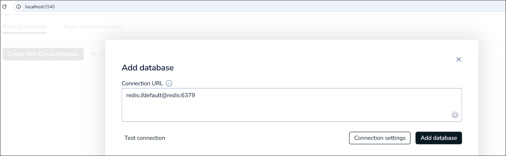

# Docker-Container für Redis #

<br>

Dieser Ordner enthält eine Datei [docker-compose.yml](docker-compose.yml) 
für den Start eines Containers mit der In-Memory-Datenbank [Redis](https://redis.io/de/)
und [Redis Insights](https://redis.io/insight/) als GUI für den direkten Zugriff auf die Redis-Instanz.

<br>

## Konfiguration *Redis Insights* ##

<br>

Verbindungs-URL: 
```
redis://default@redis:6379
```
Hierbei ist das `redis` nach dem `@`-Zeichen der Name des Containers mit dem Redis-Server
und `6379` die Default-Port-Nummer.

<br>



<br>

## Befehle für `redis-cli` ##

<br>

Terminal zu Container mit Redis-Instanz öffnen und Redis-CLI mit Befehl `redis-cli` starten.
Im folgenden werden einige Befehle aufgelistet, die 

<br>

Verbindungstest: `ping` (Antwort sollte `PONG` sein)

<br>

Alle Schlüsselwerte samt Wert ausgeben:
```
keys '*'
```

<br>

Einzelnen Wert ausgeben:
```
get produktNichtGefunden
```

<br>

Wert für bestimmten Schlüssel setzen:
```
set produktNichtGefunden 123
```

<br>

Einzelnes Key-Value-Paar löschen:
```
del produktNichtGefunden
```

<br>

Konfiguration für Persistenzmechanismen RDB (Redis Database: regelmäßige Snapshots) bzw. AOF (Append Only File: alle Änderungsoperationen werden persistiert und sind so nach einen Neustart wieder vorhanden):
```
config get save
config get appendonly 
```

<br>

Sitzung beenden: `quit` 

<br>